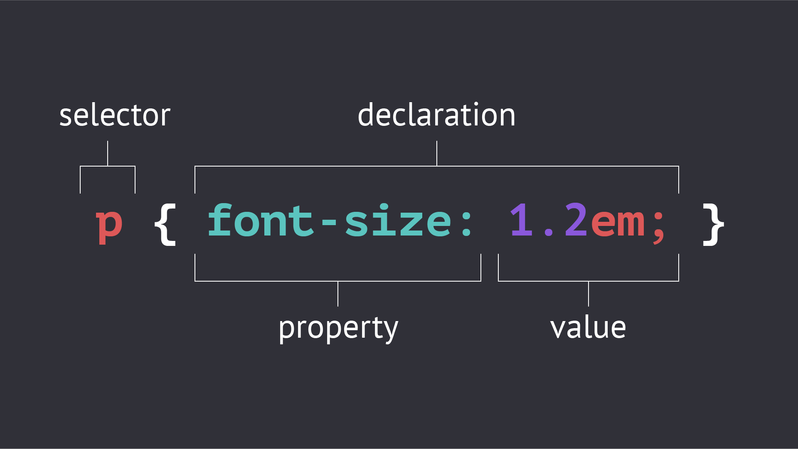

## CSS 

CSS staat voor: **C**ascading **S**tyle **S**heet


3 manieren om CSS te gebruiken

1. Inline CSS -> direct een HTMLelement (NIET AANBEVOLEN)
2. Internal CSS -> in de ``<head>`` van het HTML bestand tussen ``<style>`` tags (is al beter dan inline CSS maar de voorkeur heeft:)
3. External CSS -> apart CSS bestand waarin het HTML bestand naar wordt gelinkt (dit is de meest gebruikte en professionele manier)

Het externe CSS bestand kan gelinkt worden door onderstaande code in de ``<head> </head>`` te zetten:

````
<link rel="stylesheet" type="text/css" href="style.css" />
````


### Selectors
Selectors worden gebruikt om html-onderdelen te selecteren.

Elements -> de element naam wordt gebruikt zonder iets ervoor (voorbeeld: ``p``)

id -> de id met een '#' ervoor (voorbeeld: ``#mainmenu``)

class -> de class met een '.' ervoor (voorbeeld: ``.articles``)



[Css References](https://www.w3schools.com/cssref/ "CSS References")

