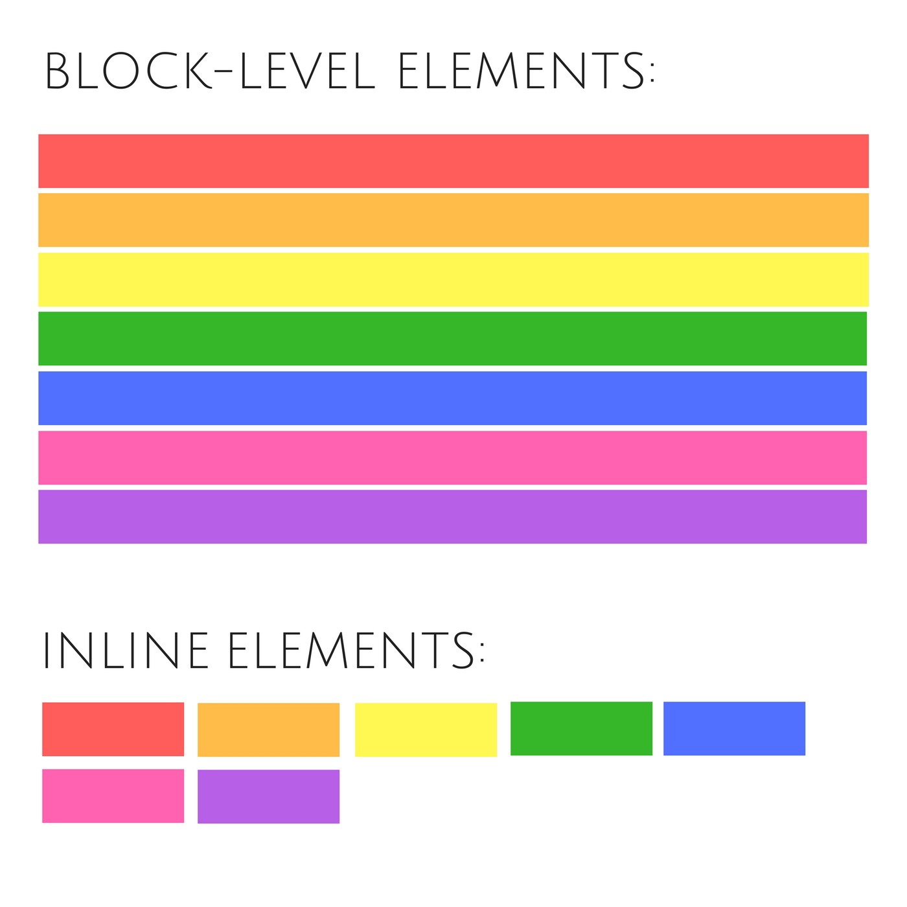

## Divs en spans

`
` en `` zijn beide html-element die je als 'container' kan gebruiken.

Verschillende manieren waarop html-elementen weergegeven worden (er zijn er meer maar deze 2 zijn erg belangrijk):

block-elements: nemen de totale breedte in van de pagina. Block-elements kunnen daarom niet naast elkaar staan. 

inline-elements: nemen alleen zo veel ruimte in als ze nodig hebben. Inline-elements kunnen daarom wel naast elkaar staan. 

`` is een inline-container

`

` is een block-container

